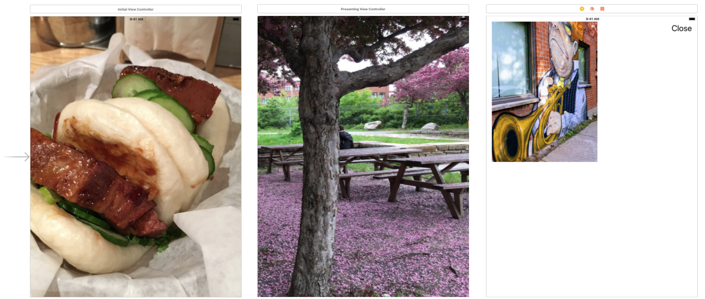

# Modal Presentation Style Demo

In this demo app, there are three view controllers: 

* **Initial View Controller**
* **Presenting View Controller**
* **Presented View Controller**

At app lauch, **Presenting View Controller** is presented on top of **Initial View Controller** with a `formSheet` style.

From **Presenting View Controller**, there are a list of buttons that will open **Presented View Controller** with different style options.

* **Current Context** v.s. **Over Current Context**

* **Full Screen** v.s. **Over Full Screen**

* **Page Sheet** v.s. **Pop Over** v.s. **Form Sheet**

